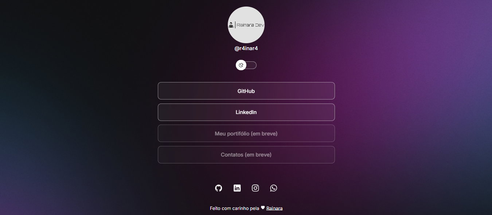
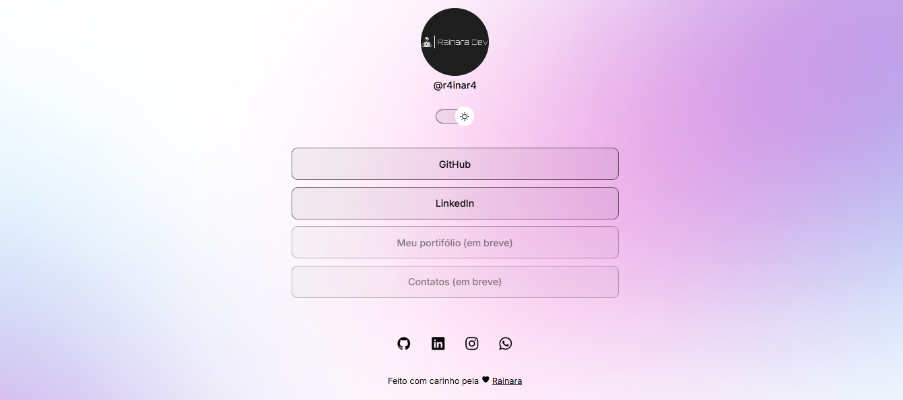

<h1 align="center"> DevLinks </h1>

  
  

## 🚀 Tecnologias

Esse projeto foi desenvolvido com as seguintes tecnologias:

- HTML e CSS
- JavaScript
- Git e Github
- Figma

## 💻 Projeto

Este projeto é um agregador de links para usar como cartão de visitas online.

- [Acesse o projeto finalizado, online](https://Ra1nara.github.io/devlinks)

## 🔖 Layout

Você pode visualizar o layout do projeto através [DESSE LINK](https://www.figma.com/community/file/1187422022288947321). É necessário ter conta no [Figma](https://figma.com) para acessá-lo.

## :memo: Licença

Esse projeto está sob a licença MIT.

---

Feito com ♥ por Rainara com o apoio do curso Discove através da Rocketseat.
